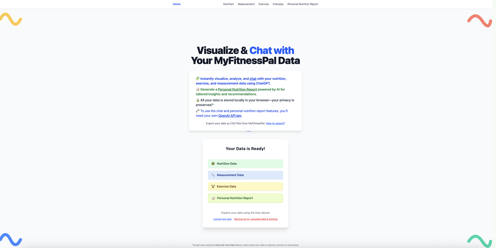

# MyFitnessData



**Visualize and analyze your MyFitnessPal data with interactive charts.**

MyFitnessData lets you upload your exported CSV data from MyFitnessPal and instantly see trends, macros, exercise, and more.

## Features
- 📊 Upload CSVs for Nutrition, Measurement, and Exercise
- 💬 Chat with your data using AI
- 📅 Interplay visualizations across all your data
- 🔒 All data stays in your browser

## Getting Started

### Prerequisites
- [Node.js](https://nodejs.org/) (v18 or newer recommended)
- [npm](https://www.npmjs.com/) (comes with Node)

### Setup
1. **Clone the repository:**
   ```bash
   git clone https://github.com/hummusonrails/myfitnessdata.git
   cd myfitnessdata
   ```
2. **Install dependencies:**
   ```bash
   npm install
   ```

### Running the Dev Server
Start the development server (default: [http://localhost:5173](http://localhost:5173)):
```bash
npm run dev
```

The app will hot-reload as you make changes.

## Usage
1. Export your data from MyFitnessPal as CSVs (Nutrition, Measurement, Exercise). [How to export?](https://support.myfitnesspal.com/hc/en-us/articles/360032623231-Exporting-Your-Data)
2. Upload your CSVs on the landing page.
3. Explore the visualizations and insights for each category!
4. Use the "Chat with your data" feature (on each section page) to ask questions and get insights from your data using AI.
   - You'll need your own OpenAI API key. [Where do I find my OpenAI API key?](https://help.openai.com/en/articles/4936850-where-do-i-find-my-openai-api-key)
   - Your key and data never leave your browser storage.
   
## License

This project is licensed under the MIT License - see the [LICENSE](LICENSE) file for details.

